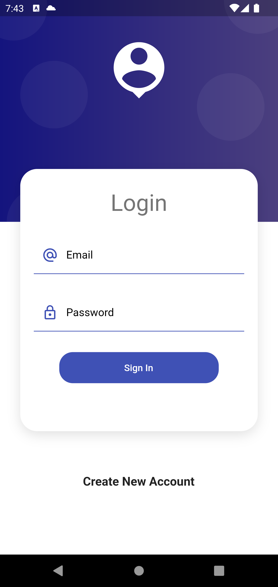
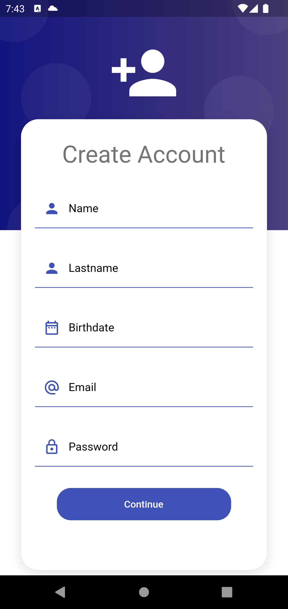
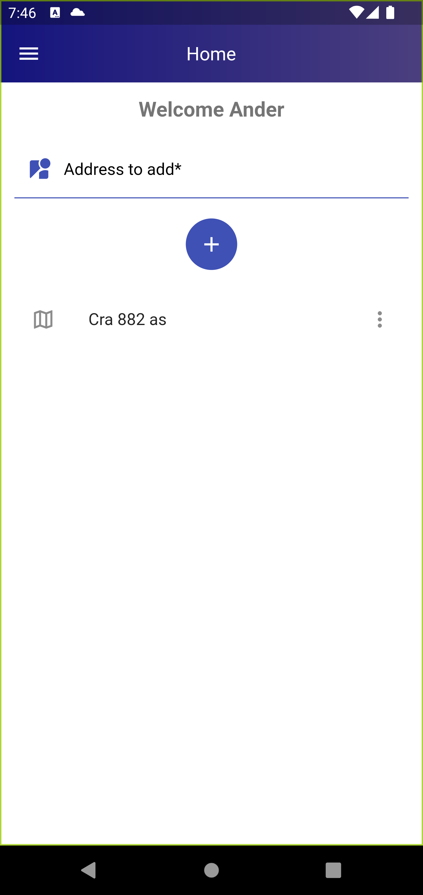
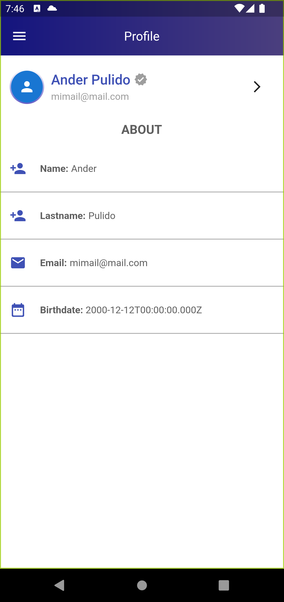
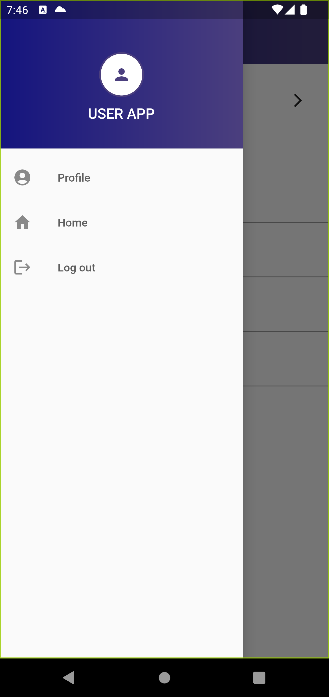

# user_app

A new Flutter project.

## Getting Started

Crea un proyecto mobile en flutter que tenga un formulario para crear un usuario
con Nombre, Apellido, fecha de nacimiento y agregar una dirección física a tu cuenta
(puedes tener muchas direcciones por usuario). El flujo deberá tener 3 pantallas, al
menos. Te recomendamos seguir buenas prácticas como control de errores, estados
y todo lo que haga que tu código sea elegante. Debemos poder pintar los datos del
usuario en cualquier momento de la aplicación.

## Capturas
Imagen 1. Pantalla Login 

Imagen 2. Pantalla Registro

Imagen 3. Pantalla Home

Imagen 4. Pantalla Perfil

Imagen 5. Pantalla Sidebar

